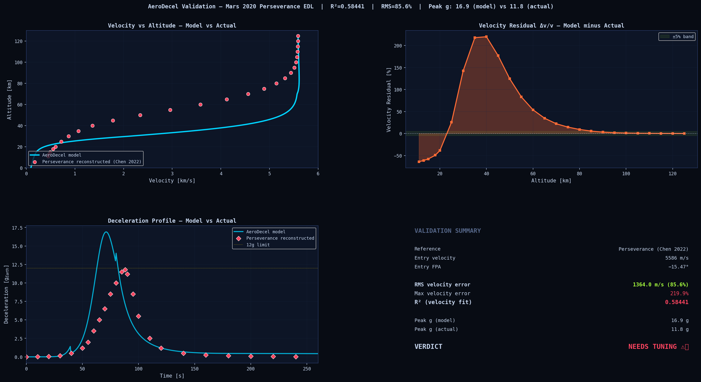
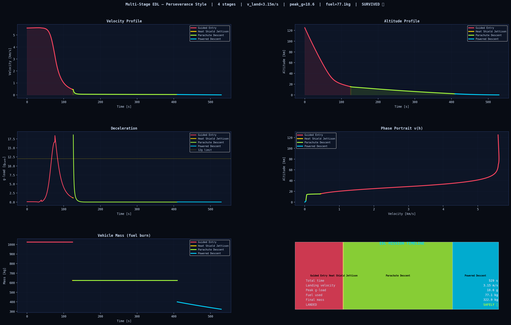
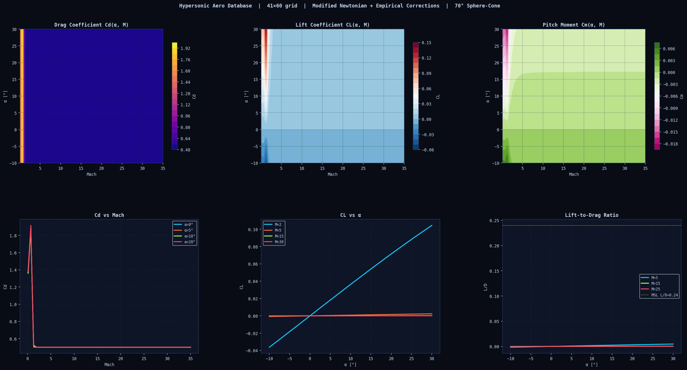

# 🚀 AeroDecel v6.1 — Project Icarus

[](LICENSE)
[](https://github.com/blaze505050/AeroDecel/actions)
[](https://www.python.org/)

> The most comprehensive open-source planetary EDL simulation framework.
> 28 features across 5 tiers. Zero cost. Zero API keys. 100% Python.

<p align="center">
  
  
  
</p>
<p align="center">
  <em>Left: Perseverance v(h) Validation &nbsp;|&nbsp; Centre: 4-Stage EDL Sequence &nbsp;|&nbsp; Right: Cd/CL/Cm Aero Database</em>
</p>

---

## Installation

```bash
# Physics only (installs in 30 seconds)
pip install -r requirements-core.txt

# Standard (physics + plotting + dashboard + testing)
pip install -r requirements.txt

# Everything (ML, 3D viz, REST API, deployment)
pip install -r requirements-full.txt
```

## Quick Start

```bash
# Tier 1+2 flagship
python main.py --masterpiece               # real-gas + MC + 3-D

# Tier 1: Physics
python main.py --sixdof --ablation --flutter --d3q19

# Tier 2: ML
python main.py --flow --multiplanet --gnn --gp-opt --online-kalman

# Tier 3: Systems Engineering  
python main.py --pareto                    # NSGA-II Pareto optimisation
python main.py --edl-opt                   # Differential evolution EDL
python main.py --fta                       # Fault tree analysis

# NEW v6.1: Validation, Aero DB, Multi-Stage
python main.py --validate-perseverance     # Compare vs real NASA data
python main.py --aero-db                   # Generate Cd/CL/Cm tables
python main.py --multistage                # 4-stage entry→landing

# Tier 4: Presentation
python main.py --gantt                     # Gantt chart + animation

# Tier 5: Software Engineering
python main.py --track                     # Experiment history
python api.py                              # REST API (needs uvicorn)
python app.py                              # Dash dashboard
pytest tests/ -v                           # Full test suite
```

---

## 📓 Tutorials (Open in Colab)

| # | Notebook | Topics |
|---|----------|--------|
| 01 | [](https://colab.research.google.com/github/blaze505050/AeroDecel/blob/main/notebooks/01_atmosphere_explorer.ipynb) Atmosphere Explorer | Mars/Venus/Titan profiles, density, temperature, speed of sound |
| 02 | [](https://colab.research.google.com/github/blaze505050/AeroDecel/blob/main/notebooks/02_realgas_chemistry.ipynb) Real-Gas Chemistry | CO₂ dissociation, γ_eff, Sutton-Graves vs Fay-Riddell heating |
| 03 | [](https://colab.research.google.com/github/blaze505050/AeroDecel/blob/main/notebooks/03_sixdof_dynamics.ipynb) 6-DOF Dynamics | Quaternion trajectory, attitude dynamics, phase portraits |
| 04 | [](https://colab.research.google.com/github/blaze505050/AeroDecel/blob/main/notebooks/04_monte_carlo_edl.ipynb) Monte Carlo EDL | Uncertainty propagation, landing ellipse, sensitivity tornado |
| 05 | [](https://colab.research.google.com/github/blaze505050/AeroDecel/blob/main/notebooks/05_full_edl.ipynb) Full EDL Pipeline | End-to-end: atmosphere → 6-DOF → ablation → fault tree |

---

## All 28 Features

### 🔥 Tier 1 — Physics (5 + 3 new)
| Flag | Module | Method |
|------|--------|--------|
| `--sixdof` | `sixdof_trajectory.py` | 13-state quaternion 6-DOF, Euler equations, Baumgarte stabilisation, stability derivatives Cmα/Cmq/Cnβ/Clp |
| (built-in) | `realgas_chemistry.py` | Park 1993 CO₂ kinetics, Gibbs equilibrium, Fay-Riddell, γ_eff drops 1.28→1.05 |
| `--ablation` | `ablation_model.py` | Amar model: Arrhenius pyrolysis+surface, Mickley-Davis blowing B', moving-boundary FD |
| `--flutter` | `aeroelastic_flutter.py` | CST triangular FEM membrane, eigsh modal, flutter U* criterion, Newmark-β time domain |
| `--d3q19` | `lbm_d3q19.py` | D3Q19 LBM, Smagorinsky SGS ν_SGS=C_s²Δ\|S̃\|, vorticity, momentum-exchange Cd/Cl |
| **`--validate-perseverance`** | **`perseverance_validation.py`** | **3-DOF vs NASA Perseverance reconstructed data, auto-Cd calibration, R² + RMS residual** |
| **`--aero-db`** | **`aero_database.py`** | **Modified Newtonian Cd/CL/Cm tables, 41×60 α×Mach grid, RegularGridInterpolator** |
| **`--multistage`** | **`multistage_edl.py`** | **4-stage Perseverance EDL: entry → heatshield jettison → DGB chute → powered descent** |

### 🌌 Tier 2 — ML (5 features)
| Flag | Module | Method |
|------|--------|--------|
| `--flow` | `normalizing_flows.py` | Real-NVP normalising flow, physics ODE penalty, full posterior P(traj\|cond) |
| `--multiplanet` | `multiplanet_operator.py` | Single FNO on Mars+Venus+Titan, planet embedding, zero-shot Triton |
| `--gnn` | `canopy_gnn.py` | MPNN graph: nodes=panels, edges=seams, per-node von Mises + safety factor |
| `--gp-opt` | `gp_emulator.py` | GP + Expected Improvement BayesOpt, minimum-mass TPS in ~50 evals |
| `--online-kalman` | `online_pinn_kalman.py` | EKF + forward ODE, real-time Cd streaming, Joseph covariance update |

### 🎯 Tier 3 — Systems Engineering (4 features)
| Flag | Module | Method |
|------|--------|--------|
| `--pareto` | `tps_multiobjective.py` | NSGA-II Pareto front (mass, SF, cost), fast non-dominated sorting, crowding distance |
| `--edl-opt` | `edl_optimiser.py` | Differential Evolution optimiser, 4 design vars, constraint margin analysis |
| `--fta` | `fault_tree.py` | Fault tree: AND/OR gates, Birnbaum+FV importance, minimal cut sets, MC uncertainty |
| (built-in) | `monte_carlo_edl.py` | 11-param LHS MC, Gumbel extreme fit, 50/90/99% KDE landing ellipse |

### ✨ Tier 4 — Presentation (3 features)
| Flag | Module | Method |
|------|--------|--------|
| `--gantt` | `mission_gantt.py` | Phase detection from physics, Gantt chart, entry animation GIF |
| (built-in) | `visualization_3d.py` | Planet sphere + trajectory heat flux tube, landing ellipse, PyVista ready |
| `--masterpiece` | Combined | Real-gas + MC + 3-D in one command |

### 🧪 Tier 5 — Software Engineering (4 features)
| Flag | Module | Description |
|------|--------|-------------|
| `--track` | `experiment_tracker.py` | SQLite DB: log every run, query by performance metrics |
| — | `api.py` | FastAPI REST: POST /simulate, /ablation, /monte_carlo, /fault_tree |
| — | `.github/workflows/ci.yml` | GitHub Actions: test→smoke→lint→deploy to HuggingFace |
| — | (LBM/ablation) | numpy + scipy; install numba for 20-50× speedup |

---

## File Map

```
AeroDecel/
├── paper.md                        ← JOSS submission paper
├── paper.bib                       ← Bibliography (BibTeX)
├── LICENSE                         ← MIT License
├── main.py                         ← All CLI flags (28 features)
├── app.py                          ← Dash dashboard (5 tabs)
├── api.py                          ← FastAPI REST API
├── config.py
├── requirements.txt                ← Standard
├── requirements-core.txt           ← Physics only (numpy+scipy)
├── requirements-full.txt           ← Everything (ML, viz, API)
├── CONTRIBUTING.md                 ← How to add planets/TPS/modules
├── .github/workflows/ci.yml        ← CI/CD pipeline
├── tests/test_v6.py
├── data/
│   └── blunt_body_aero.npz         ← Pre-computed aero database
├── notebooks/
│   ├── 01_atmosphere_explorer.ipynb
│   ├── 02_realgas_chemistry.ipynb
│   ├── 03_sixdof_dynamics.ipynb
│   ├── 04_monte_carlo_edl.ipynb
│   └── 05_full_edl.ipynb
└── src/
    ├── TIER 1: planetary_atm.py  sixdof_trajectory.py  realgas_chemistry.py
    │          ablation_model.py  aeroelastic_flutter.py  lbm_d3q19.py
    │          thermal_model.py  perseverance_validation.py  aero_database.py
    │          multistage_edl.py
    ├── TIER 2: normalizing_flows.py  multiplanet_operator.py  canopy_gnn.py
    │          gp_emulator.py  online_pinn_kalman.py
    ├── TIER 3: tps_multiobjective.py  edl_optimiser.py  fault_tree.py  monte_carlo_edl.py
    ├── TIER 4: mission_gantt.py  visualization_3d.py
    ├── TIER 5: experiment_tracker.py  [api.py at root]  [.github/]
    └── EXISTING: canopy_geometry.py  lbm_solver.py  multifidelity_pinn.py
                  neural_operator.py  operator_dataset.py
```

---

## Outputs Generated

| File | Size | Description |
|------|------|-------------|
| `perseverance_validation.png` | 244KB | **Perseverance v(h) validation: model vs NASA data** |
| `multistage_edl.png` | 248KB | **4-stage EDL: entry→jettison→chute→powered** |
| `aero_database.png` | 180KB | **Cd/CL/Cm contour maps + Mach sweeps** |
| `trajectory_3d.png` | 468KB | 3-D descent: planet + trajectory + heat flux coloured |
| `sixdof_trajectory.png` | 364KB | 6-DOF: attitude, angular rates, phase portrait, stability |
| `mc_edl_dashboard.png` | 406KB | MC: PDF/CDF, landing ellipse, tornado, Gumbel |
| `fault_tree.png` | 308KB | FTA: P(success), importance measures, cut sets |
| `tps_pareto.png` | 388KB | NSGA-II Pareto front 3-D + convergence |
| `ablation_pica.png` | 242KB | Ablation: blowing correction, recession, B' |
| `mission_gantt.png` | 246KB | EDL sequence Gantt chart |
| `entry_animation_mars.gif` | 1.1MB | Animated descent with heat glow |
| `aeroelastic_flutter.png` | 249KB | FEM modes, flutter onset, riser loads |
| `lbm_d3q19.png` | 181KB | D3Q19 vorticity, velocity field, Cd |
| `online_pinn_kalman.png` | 269KB | Real-time Cd convergence + uncertainty |
| `normalizing_flow.png` | 208KB | Posterior predictive credible intervals |
| `edl_optimiser.png` | 236KB | DE certification: compliance table + sensitivities |
| `experiment_history.png` | 110KB | SQLite run history dashboard |

---

## REST API (Tier 5)

```bash
pip install fastapi uvicorn
uvicorn api:app --reload --port 8000

# Simulate EDL
curl -X POST http://localhost:8000/simulate \
  -H "Content-Type: application/json" \
  -d '{"planet":"mars","entry_velocity_ms":5800,"use_realgas":true}'

# Fault tree
curl -X POST http://localhost:8000/fault_tree \
  -d '{"sf_tps":2.0,"sf_structure":2.5}'
```

---

## Contributing

See [CONTRIBUTING.md](CONTRIBUTING.md) for how to add new planets, TPS materials, and ML modules.

## License

AeroDecel is released under the [MIT License](LICENSE).

## Citing AeroDecel

If you use AeroDecel in your research, please cite the JOSS paper:

```bibtex
@article{aerodecel2026,
  title   = {AeroDecel: An Open-Source Multi-Fidelity Framework for Planetary Entry, Descent, and Landing Simulation},
  author  = {AeroDecel Contributors},
  journal = {Journal of Open Source Software},
  year    = {2026}
}
```

**Total cost: $0.00 · 28 features · All local · All open-source
